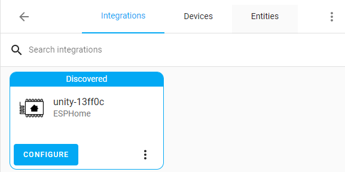

# [Unity Sensor Board](https://loopon.tech/products/unity-sensor)
This repository contains ESPHome config and example Arduino code for the Unity sensor board.
Specifications of the board can be found at https://loopon.tech/products/unity-sensor

<p align="center">
  
</p>

# Flashing the Unity board
To flash the Unity board, the ESP32 must be put in the correct boot mode:
1. Hold down the boot button.
2. Press the reset button.
3. Release the boot button.

Once flashing has completed. Prese the reset button to restart in normal mode.

# Arduino Exmaple Projects

### Platform IO
Installation guide can be found here: https://platformio.org/install/ide?install=vscode

### 1. [Blink](/Arduino%20Examples/Blink)
This project blinks LEDs on all GPIO ports.

### 2. [Bluetooth Keyboard](/Arduino%20Examples/BluetoothKeyboard)
This project will will connect as a Bluetooth keyboard and type a a few sentences.

### Windows Setup
1. Go to Settings -> Bluetooth & Devices -> Add device.
2. Select Bluetooth.
3. After the scan has completed, Unity Keyboard should appear. Click and add device.
4. Open Notepad.exe and watch it type.

### Android Setup
1. Go to Settings -> Device connection -> Pair new device.
2. Select Unity Keyboard in the list.
3. Open a notepad app and watch it type.

### 3. [Human Presence](/Arduino%20Examples/HumanPresence)
This project uses the LD2410 sensor to read the distance of a stationary or moving human.

### 4. [Rainbow](/Arduino%20Examples/Rainbow)
This project cycles through colours of the rainbow using the onboard RGB LED.

### 5. [Temperature, Humidity and Ambient Light](/Arduino%20Examples/TempHumLight)
This project prints the readings from the HDC1080 (temperature/humidity) and the BH1750 (light) sensors.

### 6. [WiFi Scanning](/Arduino%20Examples/WiFiScan)
This project will scan and print WiFi access points.

# ESPHome
The Unity board comes pre-installed with ESPHome. The config can be found [here](/ESPHome/loopon_unity.yaml).

## Connecting to WiFi Network
1. Power up the Unity board.
2. On you phone or computer, search for the "Unity" WiFi network.
3. Once connected, you will be redirected to WiFi setup page. If you are not redirected, open a browser and go to http://192.168.4.1
4. Select you WiFi network SSID and input the password if needed.
5. Click Save.
<p align="center">
  

</p>

## Home Assistant
Once you have successfully connected to your WiFi network, you can integrate the device to Home Assistant.
If you have the ESPHome Add-on already installed, then Home Assistant will automatically detect the new device. You can find it in Settings -> Integrations.
<p align="center">
  
</p>

If you do not have the ESPHome Add-on then follow the Installing ESPHome Dashboard steps [here](https://esphome.io/guides/getting_started_hassio.html).

## Modifying ESPHome Config
With ESPHome installed on your computer ([guide](https://esphome.io/guides/installing_esphome.html)), you can modify the [loopon_unity.yaml](./ESPHome/loopon_unity.yaml), compile and flash the Unity board.

To compile and flash use:
```sh
# Make sure Unity board is in Flash mode
esphome run ./ESPHome/loopon_unity.yaml --no-logs
# Reset device when done
```

To monitor logs use:
```sh
esphome logs ./ESPHome/loopon_unity.yaml --device=COM19 
```

You can optionally add the device port to the commands above:
```sh
 --device=COM19 
```