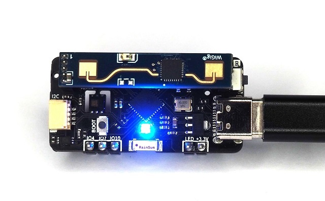
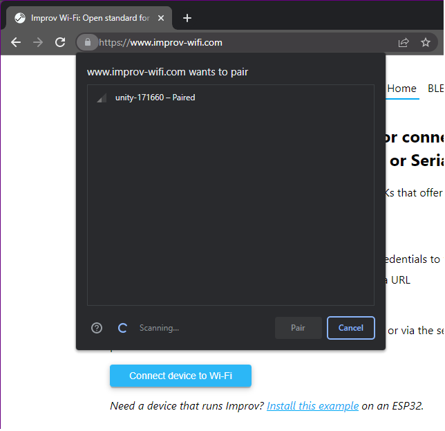
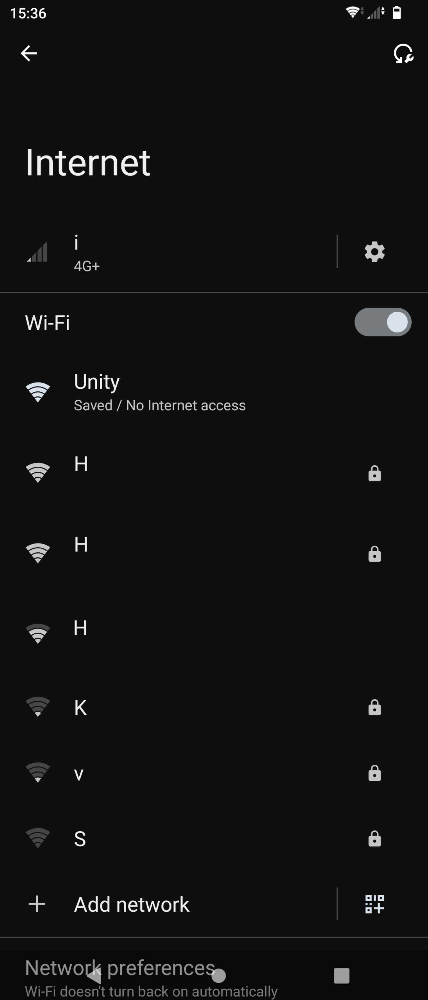
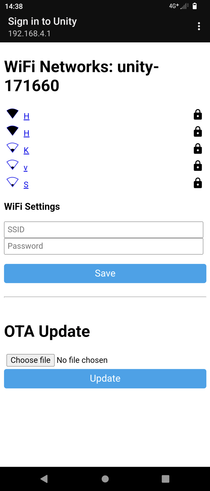
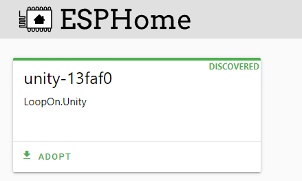
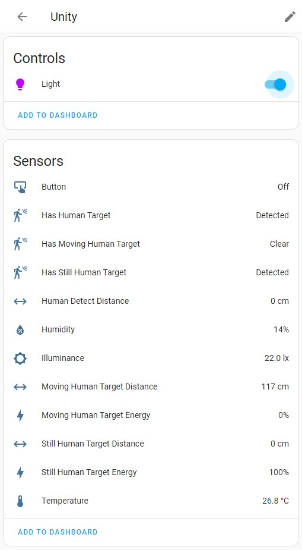
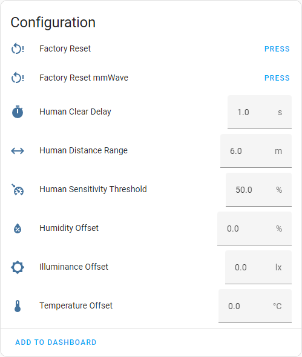

# [Unity Sensor Board](https://loopon.tech/products/unity-sensor)<!-- omit from toc -->
This repository contains the pre-installed ESPHome config and example Arduino code projects for the Unity sensor board.
Specifications of the board can be found at https://loopon.tech/products/unity-sensor
<p align="center">
  
</p>


> 

&#x26a0;&#xfe0f; **Caution**: Some electronic components are highly sensitive to Electrostatic Discharge and are damaged easily by this. Avoid direct contact with sensors, LED and the ESP.


# Table of Contents<!-- omit from toc -->
- [Getting Started](#getting-started)
  - [Connecting to WiFi](#connecting-to-wifi)
- [Home Assistant](#home-assistant)
  - [Discovery](#discovery)
  - [View Device](#view-device)
- [Modifying ESPHome Config](#modifying-esphome-config)
  - [Using ESPHome Dashboard in Home Assistant](#using-esphome-dashboard-in-home-assistant)
  - [Using ESPHome CLI](#using-esphome-cli)
- [Flashing the Unity Board](#flashing-the-unity-board)
- [Arduino Example Projects](#arduino-example-projects)
  - [1. Blink](#1-blink)
  - [2. Bluetooth Keyboard](#2-bluetooth-keyboard)
  - [3. Human Presence](#3-human-presence)
  - [4. Rainbow](#4-rainbow)
  - [5. Temperature, Humidity and Ambient Light](#5-temperature-humidity-and-ambient-light)
  - [6. WiFi Scanning](#6-wifi-scanning)

# Getting Started
The Unity board comes pre-installed with ESPHome. The configuration can be found [here](./esphome/loopon_unity.yaml).

## Connecting to WiFi
There are two ways to connect the Unity board to your WiFi network:

### Using Imrpov<!-- omit from toc -->
1. Power up the Unity board.
1. Go to https://www.improv-wifi.com/ on your phone or a computer with Bluetooth.
1. Click "Connect device to Wi-Fi".
1. Select the Unity device.
<p align="center">
  
</p>

5. Input your SSID and password.
1. Click Save.

### Using the Access Point<!-- omit from toc -->
1. Power up the Unity board.
1. On your phone or computer, search for the Unity WiFi network.
1. Once connected, your phone will be redirected to the WiFi setup page. If you are not redirected, open a browser and go to http://192.168.4.1
1. Select your WiFi network SSID from the list and input the password if needed.
1. Click Save.
<p align="center">
  

</p>

# Home Assistant
Once you have successfully connected to your WiFi network, you can integrate the device to Home Assistant.
You must have the ESPHome Add-on installed. If you do not have the Add-on then follow the 'Installing ESPHome Dashboard' guide [here](https://esphome.io/guides/getting_started_hassio.html).

## Discovery
Home Assistant and the ESPHome Add-on will automatically detect the Unity device.

You can find the device in:
* Integrations: [](https://my.home-assistant.io/redirect/integrations/)
<p align="center">
  
</p>

* ESPHome Dashboard: [](https://my.home-assistant.io/redirect/supervisor_ingress/?addon=5c53de3b_esphome)
<p align="center">
  
</p>

Note: If the device does not show up then please try restarting Home Assistant. [](https://my.home-assistant.io/redirect/server_controls/)

## View Device
You can now view the Unity board in [](https://my.home-assistant.io/redirect/devices/)
<p align="center">
  
</p>

For best results, use the recommended settings in the screenshot below for the human presence sensor.
<p align="center">
  
</p>

# Modifying ESPHome Config
You can modify the way the device behaves by compiling and flashing the Unity board.

## Using ESPHome Dashboard in Home Assistant
1. Go to the ESPHome dashboard in Home Assistant.
2. Select the device you would like to modify and click "Edit".
3. Make your changes in the yaml and click "Install".
4. Select "Wirelessly" from the pop-up.
5. ESPHome will now compile the latest yaml and install it on the device. This will take a few minutes.

## Using ESPHome CLI
1. Make sure ESPHome is installed on your computer ([guide](https://esphome.io/guides/installing_esphome.html)).
1. Clone this repo: 
```git clone https://github.com/LoopOnCode/UnitySensor``` or download and extract the zip.
1.  Make your changes to [loopon_unity.yaml](./esphome/loopon_unity.yaml).
1.  Put the device into flash mode. See [here](#flashing-the-unity-board).
1.  Compile and flash:
```esphome run ./UnitySensor/esphome/loopon_unity.yaml --no-logs```
1.  Reset the device.

# Flashing the Unity Board
To flash the Unity board, it must be put in the correct boot mode.
You can do this by:
1. Connecting the device to a computer using a USB-C cable.
1. Holding down the boot button.
1. Momentarily pressing the reset button.
1. Then, releasing the boot button.

Once flashing has completed, press the reset button to restart in normal mode.

# Arduino Example Projects

## PlatformIO<!-- omit from toc -->
PlatformIO is a cross-platform IDE extension for Visual Studio Code.
Use PlatformIO to open, build and upload the example projects to the Unity board. 
The installation guide can be found [here](https://platformio.org/install/ide?install=vscode).

## 1. [Blink](/Arduino%20Examples/Blink)
This project will blink LEDs on all GPIO ports.

## 2. [Bluetooth Keyboard](/Arduino%20Examples/BluetoothKeyboard)
This project will simulate a Bluetooth keyboard and will type a few sentences when connected to a computer or mobile device. 

### Windows Setup<!-- omit from toc -->
1. Go to Settings -> Bluetooth & Devices -> Add device.
1. Select Bluetooth.
1. After the scan has completed, the 'Unity Keyboard' should appear. Click and add device.
1. Open Notepad.exe and watch it type.

### Android Setup<!-- omit from toc -->
1. Go to Settings -> Device connection -> Pair new device.
1. Select Unity Keyboard in the list.
1. Open a notepad app and watch it type.

## 3. [Human Presence](/Arduino%20Examples/HumanPresence)
This project uses the LD2410 sensor to read the distance of a stationary or moving human.

## 4. [Rainbow](/Arduino%20Examples/Rainbow)
This project cycles through colours of the rainbow using the onboard RGB LED.

## 5. [Temperature, Humidity and Ambient Light](/Arduino%20Examples/TempHumLight)
This project prints the readings from the HDC1080 (temperature/humidity) and the BH1750 (light) sensors.

## 6. [WiFi Scanning](/Arduino%20Examples/WiFiScan)
This project will scan and print WiFi access points.
